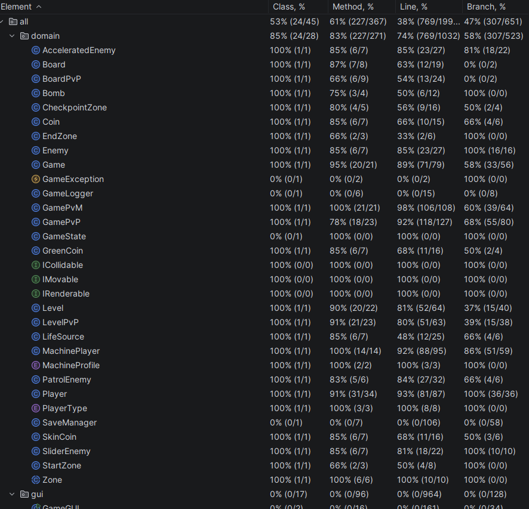

# 🎮 The DOPO Hardest Game

> Inspirado en *The World's Hardest Game*, desarrollado en Java con Swing.

**Autores:**
- 👤 Nicolás Prieto Ramos
- 👤 Sebastián Peña Sánchez

**Curso:** Ingeniería de Software — 2026  
**Universidad:** Pontificia Universidad Javeriana  
**Tecnología:** Java 17+ · Maven · JUnit 5 · IntelliJ IDEA

---

## 📋 Descripción

The DOPO Hardest Game es un juego de habilidad y reflejos en 2D donde el jugador controla un cuadrado rojo y debe recoger todas las monedas del nivel para luego llegar a la zona final, evitando a los enemigos. El juego cuenta con 3 modos de juego, 4 niveles de dificultad progresiva y múltiples elementos especiales.

---

## 🕹️ Modos de Juego

El juego ofrece **3 modos**:

| Modo | Descripción | Controles |
|------|-------------|-----------|
| **Un Jugador** | El jugador clásico: recoge monedas y llega a la meta antes de que se acabe el tiempo. | Flechas del teclado |
| **Jugador vs Jugador (PvP)** | Dos jugadores compiten en el mismo tablero. Cada uno inicia en un extremo opuesto y debe llegar al extremo contrario. Gana quien llegue primero. | J1: Flechas · J2: WASD |
| **Jugador vs Máquina (PvM)** | El jugador compite contra una IA con dos perfiles de dificultad: **RANDOM** (movimiento aleatorio) y **EXPERT** (busca monedas y evita paredes). | Flechas del teclado |

---

## 🗺️ Niveles

El juego tiene **4 niveles** de dificultad progresiva, disponibles en los 3 modos:

### Nivel 1 — Fácil
- Tablero con obstáculos en forma de L
- 4 monedas amarillas
- 2 enemigos básicos (horizontal y vertical)

### Nivel 2 — Intermedio
- Laberinto más complejo con pasillos estrechos
- 8 monedas (6 normales + 2 SkinCoins en PvP/PvM)
- 1 enemigo básico + 3 enemigos patrulleros
- 1 zona de checkpoint central

### Nivel 3 — Difícil
- Laberinto en zigzag con pasillos muy angostos
- 8 monedas amarillas + 1 GreenCoin
- 5 SliderEnemies + 5 AcceleratedEnemies
- 6 bombas estáticas

### Nivel 4 — Muy Difícil
- Diseño en forma de cruz con corredores en zigzag
- 10 monedas + 1 SkinCoin + 1 GreenCoin
- 8 AcceleratedEnemies
- 4 bombas + 2 fuentes de vida (LifeSource)

---

## 💰 Tipos de Monedas

| Moneda | Color | Efecto |
|--------|-------|--------|
| **Coin** (normal) | 🟡 Amarilla | Debe recogerse para poder completar el nivel |
| **SkinCoin** | 🔵 Azul | Transforma al jugador en **Inky** (azul): velocidad y tamaño ×1.5 |
| **GreenCoin** | 🟢 Verde | Transforma al jugador en **Clyde** (verde): resistente, absorbe el primer golpe sin morir |

---

## 👾 Tipos de Enemigos

| Enemigo | Color | Comportamiento | Dificultad |
|---------|-------|----------------|------------|
| **Enemy** (básico) | 🔵 Azul | Se mueve en línea recta (horizontal o vertical), rebota en paredes | Baja |
| **PatrolEnemy** | 🔵 Azul oscuro | Sigue una ruta circular predefinida (waypoints) | Media |
| **SliderEnemy** | 🔵 Azul | Se desplaza exclusivamente en vertical, rebota arriba y abajo | Baja |
| **AcceleratedEnemy** | 🔵 Azul | Se mueve al doble de velocidad (6 px/tick), rebota en paredes | Alta |

---

## ✨ Elementos Especiales

| Elemento | Descripción |
|----------|-------------|
| **CheckpointZone** 🟩 | Zona verde intermedia. Al pisarla, el jugador reaparece aquí al morir (conservando monedas ya recogidas) |
| **Bomb** 💣 | Bomba estática negra. Mata al instante al tocarla. No desaparece |
| **LifeSource** ❤️ | Corazón rojo. Otorga un escudo: el primer golpe de enemigo no mata, solo reposiciona |
| **StartZone** 🟦 | Zona azul de inicio. Zona segura donde reaparece el jugador |
| **EndZone** 🟦 | Zona azul de llegada. Completar el nivel requiere estar aquí con todas las monedas |

---

## 🧩 Tipos de Jugador

| Tipo | Color | Velocidad | Tamaño | Descripción |
|------|-------|-----------|--------|-------------|
| **RED** | 🔴 Rojo | 3 px/tick | 20×20 | Estado base del jugador |
| **BLUE (Inky)** | 🔵 Azul | 4 px/tick | 30×30 | Obtenido con SkinCoin. Más rápido y grande |
| **GREEN (Clyde)** | 🟢 Verde | 3 px/tick | 20×20 | Obtenido con GreenCoin. Absorbe un golpe |

---

## ⏱️ Reglas Generales

- Cada nivel tiene un límite de **3 minutos** (180 segundos). Si se agota → `TIMEOUT`
- Al morir sin checkpoint: el jugador vuelve al inicio y las monedas se reinician
- Al morir con checkpoint activo: el jugador reaparece en el checkpoint conservando monedas
- En PvP/PvM: la muerte de un jugador **no afecta** las monedas del otro
- El juego se puede **pausar** (tecla P) y **reiniciar** en cualquier momento
- Se puede **guardar y cargar** la partida (modos Single y PvP)

---

## 🏗️ Arquitectura del Proyecto

```
src/
├── main/java/
│   ├── domain/          # Lógica del juego (sin dependencias de GUI)
│   │   ├── Game.java            # Singleton - modo un jugador
│   │   ├── GamePvP.java         # Controlador modo PvP
│   │   ├── GamePvM.java         # Controlador modo PvM
│   │   ├── Player.java          # Jugador humano
│   │   ├── MachinePlayer.java   # IA (hereda de Player)
│   │   ├── Level.java           # Nivel single player
│   │   ├── LevelPvP.java        # Nivel PvP/PvM
│   │   ├── Enemy.java           # Enemigo básico
│   │   ├── PatrolEnemy.java     # Enemigo patrullero
│   │   ├── SliderEnemy.java     # Enemigo deslizador
│   │   ├── AcceleratedEnemy.java# Enemigo acelerado
│   │   ├── Coin.java            # Moneda normal
│   │   ├── SkinCoin.java        # Moneda de transformación azul
│   │   ├── GreenCoin.java       # Moneda de transformación verde
│   │   ├── Bomb.java            # Bomba estática
│   │   ├── LifeSource.java      # Fuente de vida
│   │   ├── CheckpointZone.java  # Zona de checkpoint
│   │   ├── SaveManager.java     # Guardado/carga de partidas
│   │   └── GameState.java       # Constantes de estado
│   └── gui/             # Interfaz gráfica (Swing)
│       ├── GameGUI.java         # Ventana principal
│       ├── GamePanel.java       # Panel modo single
│       ├── PvPPanel.java        # Panel modo PvP
│       ├── PvMPanel.java        # Panel modo PvM
│       ├── LevelFactory.java    # Fábrica de niveles
│       ├── MainMenuPanel.java   # Menú principal
│       └── InstructionsPanel.java # Pantalla de instrucciones
└── test/java/domain/    # Pruebas unitarias y de aceptación
    ├── GameTest.java
    ├── PlayerTest.java
    ├── CoinTest.java
    ├── EnemyTest.java
    ├── LevelTest.java
    ├── SinglePlayerAcceptanceTest.java
    ├── PvPAcceptanceTest.java
    └── PvMAcceptanceTest.java
```

**Patrones de diseño aplicados:**
- **Singleton** — `Game` (modo un jugador)
- **Factory Method** — `LevelFactory` (construcción de niveles)
- **Strategy** — `MachineProfile` (comportamiento de la IA: RANDOM / EXPERT)
- **Template Method** — Interfaces `IMovable`, `ICollidable`, `IRenderable`

---

## 🧪 Pruebas

### Cobertura de Pruebas

El proyecto cuenta con **8 clases de prueba** con más de **40 casos de prueba** que cubren:

- Estado inicial del juego
- Lógica de muerte y respawn
- Sistema de checkpoints
- Recolección de monedas
- Condición de victoria
- Pausa y reinicio
- Progresión de niveles
- Tiempo agotado (TIMEOUT)
- Independencia de monedas en PvP/PvM
- Comportamiento de la IA (RANDOM y EXPERT)
- Patrón Singleton

### Resultado de Coverage (IntelliJ)

> Ejecutar con: `Run > Run with Coverage` sobre el directorio `src/test/java/domain/`



### Análisis Estático

El código fue analizado con las herramientas integradas de IntelliJ IDEA:

- Sin variables no utilizadas
- Sin imports innecesarios
- Javadoc completo en todas las clases públicas
- Separación estricta entre capa de dominio y GUI (dominio sin imports de `java.awt` excepto `Rectangle` y `Graphics`)

### Análisis Dinámico

Pruebas de comportamiento en tiempo de ejecución verificadas:

| Escenario | Resultado |
|-----------|-----------|
| Jugador colisiona con enemigo → muere y reaparece | ✅ |
| Jugador recoge moneda → desaparece del tablero | ✅ |
| Jugador llega a EndZone sin monedas → no gana | ✅ |
| Jugador llega a EndZone con monedas → gana | ✅ |
| Timer llega a 0 → estado TIMEOUT | ✅ |
| Muerte de J1 en PvP → monedas de J2 intactas | ✅ |
| Máquina EXPERT se mueve hacia monedas | ✅ |
| Checkpoint activo → respawn en checkpoint | ✅ |
| LifeSource → absorbe primer golpe | ✅ |
| Reinicio → muertes y tiempo a cero | ✅ |

---

## ▶️ Cómo Ejecutar

### Requisitos
- Java 17 o superior
- Maven 3.8+

### Compilar y ejecutar
```bash
mvn compile
mvn exec:java -Dexec.mainClass="gui.GameGUI"
```

### Ejecutar pruebas
```bash
mvn test
```

### Ejecutar con cobertura (IntelliJ)
1. Click derecho sobre `src/test/java/domain/`
2. Seleccionar **"Run 'All Tests' with Coverage"**
3. Ver el reporte en el panel **Coverage**

---

## 🎮 Controles

| Acción | Un Jugador / J1 PvP | J2 PvP |
|--------|---------------------|--------|
| Mover | ↑ ↓ ← → | W A S D |
| Pausar | P | P |
| Reiniciar | R (en menú) | — |

---

## 📦 Dependencias

```xml
<dependency>
    <groupId>org.junit.jupiter</groupId>
    <artifactId>junit-jupiter</artifactId>
    <version>5.10.0</version>
    <scope>test</scope>
</dependency>
```
